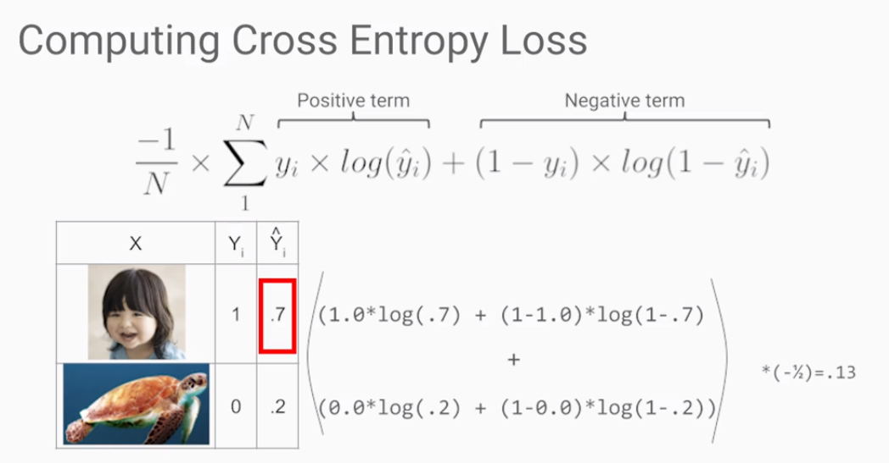

## 写在前面

* 逻辑回归基于分布：回归（拟合样本点的超平面）+sigmoid(变成概率)

* Logistic回归优点：
    1. 实现简单；
    2. 分类时计算量非常小，速度很快，存储资源低；
* 缺点：
    1. 容易欠拟合，一般准确度不太高
    2. 只能处理两分类问题（在此基础上衍生出来的softmax可以用于多分类），且必须线性可分；

> 解决二分类问题，如果有多分类，可以先二分类，然后继集成，因为每个学习器输出每个样本是正样本的概率，
所以可以对于每个样本取最大的学习器的预测结果。这种是分类比较少的情况下使用

* [Logistic Regression(逻辑回归)详细讲解](https://blog.csdn.net/joshly/article/details/50494548)
    * s的取值是[−∞,+∞]的值，但是我们想要的是一个[0,1]之间的值。因此需要一个转换函数来把这个分数转换成[0,1]之间的值。
    这个函数称为Logistic 函数，Logistic函数是一个S形的函数。 
    * 先把问题归为极大似然问题，然后利用梯度下降求解；
    
* [【机器学习笔记1】Logistic回归总结](https://blog.csdn.net/achuo/article/details/51160101)
    * 基本原理
        1. 找一个合适的预测函数，一般表示为h函数，该函数就是我们需要找的分类函数，它用来预测输入数据的判断结果。
        2. 构造一个Cost函数，该函数表示预测的输出（h）与训练数据类别（y）之间的偏差，将Cost求和或者求平均，
        记为J(θ)函数，表示所有训练数据预测值与实际类别的偏差。
        3. J(θ)函数的值越小表示预测函数越准确，所以这一步需要做的是找到J(θ)函数的最小值。
        找函数的最小值有不同的方法，Logistic Regression实现时有的是梯度下降法（Gradient Descent）。
    
* [极大似然估计详解](https://blog.csdn.net/zengxiantao1994/article/details/72787849)
    * 在固定输入下，估计参数
    * 参数是什么的时候，输出最有可能是给定的值，这些参数就是我们要的

* [github code](https://github.com/apachecn/MachineLearning/blob/master/docs/5.Logistic%E5%9B%9E%E5%BD%92.md)
    * 如果目标函数是损失函数，那就是最小化损失函数来求函数的最小值，就用梯度下降。 
    如果目标函数是似然函数（Likelihood function），就是要最大化似然函数来求函数的最大值。
    在逻辑回归中， 损失函数和似然函数无非就是互为正负关系。
    * 处理数据中的缺失值
        * 使用可用特征的均值来填补缺失值；
        * 使用特殊值来填补缺失值，如 -1；
        * 忽略有缺失值的样本；
        * 使用有相似样本的均值添补缺失值；
        * 使用另外的机器学习算法预测缺失值。


    
* 如要将回归方法应用在分类任务上怎么办？
* y = 1 / (1 + e^-z)
* 是一种 sigmoid 函数
* 优点
    * 是一种分类学习方法
    * 直接对分类可能性进行建模，无需事先假设数据的分布，这样避免了假设分布不准确带来的问题
    * 不仅预测出类别，还得到了近似概率预测，
    * 函数任意阶可导凸函数

* 正例的预测值越大越好，反例的预测值越小越好



## 手写版笔记




















### 参考资料


* 入门基本概念到编程接口
    * [优达学城 机器学习入门](https://classroom.udacity.com/courses/ud120)
* 体系三门
    * [机器学习角度-回归视频](https://www.coursera.org/learn/ml-regression/home/welcome)
    * [吴恩达机器学习课程-回归](https://www.coursera.org/learn/machine-learning/lecture/wlPeP/classification)
    * [回归基础知识](https://www.coursera.org/learn/regression-models/home/week/1)
        * [对应的课件](linear_model/07_RegressionModels)
            * [Advanced Linear Models for Data Science 1: Least Square](https://www.coursera.org/learn/linear-models/home/info)
            * [Advanced Linear Models for Data Science 2: Statistical Linear Models](https://www.coursera.org/learn/linear-models-2/home/info)
        * [配套书籍-Regression Models for Data Science in R](https://leanpub.com/regmods/read)
        * [配套书籍-Statistical inference for data science](https://leanpub.com/LittleInferenceBook/read)
* 《机器学习实战》回归章节



