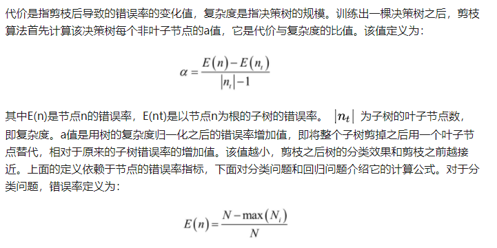

 ## 本章概要 ##

## 写在前面



* [理解决策树](https://zhuanlan.zhihu.com/p/37954086)
    * 决策树是分段线性函数但不是线性函数，它具有非线性建模的能力。只要划分的足够细，
    分段常数函数可以逼近闭区间上任意函数到任意指定精度，因此决策树在理论上可以对任意复杂度的数据进行分类或者回归。
    * 何时停止分裂，把节点设置为叶子节点？对于分类问题，当节点的样本都属于同一类型时停止，但是这样可能会导致树的节点过多、深度过大，
    产生过拟合问题。另一种方法是当节点中的样本数小于一个阀值时停止分裂;
    * 我们需要评价的是分裂的好坏，因此需要根据这个不纯度构造出分裂的不纯度。分裂规则将节点的训练样本集分裂成左右两个子集，
    分裂的目标是把数据分成两部分之后这两个子集都尽可能的纯，因此我们计算左右子集的不纯度之和作为分裂的不纯度，
    显然求和需要加上权重，以反映左右两边的训练样本数。
    * 最后是剪枝：
    
    
* [第3章 决策树](https://github.com/apachecn/MachineLearning/blob/master/docs/3.%E5%86%B3%E7%AD%96%E6%A0%91.md#%E5%86%B3%E7%AD%96%E6%A0%91-%E6%A6%82%E8%BF%B0)
    * 熵（entropy）： 熵指的是体系的混乱的程度，
    
* [如何理解决策树的损失函数?](https://www.zhihu.com/question/34075616)
    * 显而易见，衡量“决策树完全一致”的说明的是【确定性】吧？即确定性越强的损失函数最优值，说明学习方法效果越好。
    即损失函数要满足：熵值越小函数结果越好。
    * 显而易见，对于“决策树而言”，分类确定性越强的，损失就越小吧。
    * 不能完全按照极端的情况去处理，毕竟如果每个叶节点一个样本，咱们的分类也没那么多啊，是吧？这如何是好？机器学习的思路，
    或者说统计学的思路咱们就可以借鉴了，既然咱们不能保证每个最小，那咱们就求他们和的极限，因为决策树的熵都是大于0的，
    所以熵的和最小，就可以保证每个个体都是相对最小的，就可以保证整体最优。所以咱们将决策树的经验损失函数定义为，所有叶节点熵之和：
    ， N(t)是决策树在该节点的样本数,
    
    *  交叉熵对误分率是一个大的改进, 至少两方面相比误分率是有优势的,一是误分率是不可微的(可微是很重要地),
    另外一个是效果要比直接误分率更好(如果效果更差, 当然不会被引进来了).
    
    * 机器学习是一门思考的科学，万变不离其中，多考虑基础，多思考思路，总思维、轻记忆。千万不能死记硬背，碰到迷茫的问题的时候，
    站在解决问题的角度去思考一个方案，你往往就能够明白这些书本中觉得“理所当然的公式”的意义了。
    * 判别模型只是给定输入的一个输出，而生成模型也会带有生成模型的过程，所以判别模型容易过拟合，对于缺失数据无能为力，
    生成模型不容易过拟合，过于缺失数据也有一定的分类能力。
    * 为什么要乘以Nt: 这个叶子节点内部取k个类的不确定度，注意是节点【内部】的不确定度，每个叶子节点可以看作是独立的，
    既然是内部的事情，凭什么暴力的将各个内部的不确定度相加，我们至少到同一个级别的平台再加吧。所以使用节点元素的个数
    做一个加权。如果概率看做频率，那么这里就成了某一类出现的次数。

## 决策树的优劣总结 ##

根据[sklearn官网 - 1.10.Decision Trees](http://scikit-learn.org/stable/modules/tree.html)总结如下：

1. 优势（Advantages）：

	- 易理解，解释性好，易可视化；
	- 数据预处理少；
	- 复杂度O(logN)；
	- 支持标称变量+连续变量；
	- 支持多输出；
	- 白盒模型，布尔逻辑；
	- 模型好坏易验证；
	- 容忍先验知识错；

2. 劣势（Disadvantages）：
	
	- 决策树生成易太大、**过拟合**；（需要**剪枝**、设置树**最大深度**等后续操作。）
	- 模型生成**不稳定**，易受小错误样本影响；
	- 学习最优模型是**N-P难题**，贪心搜索易陷入**局部最优**；（可采用随机初始化生成多个模型。）
	- 不支持非线性逻辑，如**XOR**；
	- **数据不平衡**时生成的树形差；



## 手写笔记
 
 
 



## 课后练习 ##

#### 4.1 冲突数据影响决策树 ####
> 

考虑决策树的生成（书p74图4.2），算法生成叶节点，并**递归返回条件**有：

- 当前节点的所有样本属于同一类，叶节点类标签 -> 当前类；
- 当前节点的所有样本在属性上取值相同，叶节点类标签 -> 样本中最多类；

由此可见，若两训练数据样本特征向量相同，那么它们会到达决策树的同一叶节点（只代表某一类），若二者数据标签不同（冲突数据），则会出现训练误差，决策树与训练集不一致。

如果没有冲突数据，到达某节点的样本会出现以下两种情况：

- 样本间特征向量相同且属于同一类，满足递归结束条件，该节点为叶节点，类标签正确（无训练误差）；
- 样本间特征向量不同时，递归结束条件不满足，数据会根据属性继续划分，直到上一条情况出现。

综上得证，当数据集不含冲突数据时，必存在与训练集一致（训练误差为0）的决策树。

----

#### 4.2 决策树划分选择准则 ####
> 

由于训练集和真实集往往存在差异，若采用训练误差作为度量，模型常会出现**过拟合**，导致**泛化能力**差。

----

#### 4.3 编程实现ID3算法 ####
> 

即ID3算法，这里我们基于Python独立编程实现。详细过程见：

[编程实现ID3算法](./decision_tree/编程实现ID3算法.md)

----


#### 4.4 编程实现CART算法与剪枝操作 ####
> 

即CART算法，这里我们基于Python独立编程实现。详细过程见：

[周志华《机器学习》课后习题解答系列（五）：Ch4.4 - 编程实现CART算法与剪枝操作](http://blog.csdn.net/snoopy_yuan/article/details/69223240)

----

#### 4.5 基于对率回归进行划分选择 ####

> 

这里提一下我的思路：
参考书p90-91的**多变量决策树**模型，这里我们将每个非叶节点作为一个对率回归分类器，输出为"是"、"否"两类，形成形如二叉树的决策树。

----

#### 4.6 各种决策树算法的比较 ####

> 

简要的分析一下：

 - **ID3**算法基于信息熵增益，**CART**算法则采用了基尼系数。两种划分属性选择均是基于**数据纯度**的角度，方法差距应该不大（CART可能要好一点）。而**对率回归**进行划分选择，以**斜划分**的方式，实现了多变量参与划分，其模型决策边界更光滑。
 - 相比于决策树的生成算法，**剪枝操作**更影响模型性能。

----

#### 4.7 非递归决策树生成算法 - DFS ####

> 

下面主要是本题的一种视角：

首先做一些分析：

- 从数据结构算法的角度来看，生成一棵树常用**递归**和**迭代**两种模式。
- 采用递归时，由于在递归时要存储程序入口出口指针和大量临时变量等，会涉及到不断的压栈与出栈，当递归层次加深，压栈多于出栈，内存消耗扩大。
- 这里要采用**队列**数据结构来生成决策树，虽然避免了递归操作产生的内存消耗，但需要更大的额外存储空间。
- 用MaxDepth来控制树的深度，即**深度优先**（Depth Fisrt）的形式，一般来说，使用递归实现相对容易，当然也可以用非递归来实现。

下面设计出基于**队列+深度控制**的决策树非递归生成算法：

	----
	输入: 训练集 D = {(x1,y1),(x2,y2),...,(xm,ym)}.
	      属性集 A = {a1, a2,...,ad}.

	过程: 函数 TreeGenerate(D,A):
	1. 生成根节点 root;
	2. 初始化深度 depth = 0;
	3. 生成栈 stack （为保存顶节点root及其对应的数据D和深度depth）;
	4. 
	5. while D != Φ OR stack不为空:
	6.     if D != Φ, then
	7.         if D中样本全属于同一类别C, then
	8.             root标记为C类叶节点, D = Φ, continue;
	9.         end if
	10.        if depth == MaxDepth OR D中样本在属性A上取值相同, then
	11.             root标记为D取值中最多类的叶节点, D = Φ, continue;
	12.        end if
	13.        从A中选择最优划分属性a*, 令Dv表示D中在a*上取值为a*v的样本子集;
	14.        生成子节点 child, 为root建立分支指向child;
	15.        将[root, D\{Dv}, A, depth]压入栈stack;
	16.        令 root = child, D = Dv, A = A\{a*}, depth = depth+1;
	17.    else
	18.        从stack中弹出[root, D, A, depth];
	19.    end if

	输出: 树的根节点root.(即以root为根节点的树) 
	----

实际上，这里的算法实用的是栈而非完全意义上的队列。

个人认为，从数据结构的角度来看，栈和队列的最大区别在于FILO和FIFO，即**存取元素时索引的区别**，并不存在太大的存储实现区别。进一步说明，对于很多程序环境，如C++,Java等，均可以基于队列（Queue）构造栈（Stack）结构，由此构建的栈数据结构和队列底数据结构层实现相同。

题干中所说的栈“溢出”，主要应该是指递归时程序信息压栈所导致，相比于非递归的算法，其压栈数据量大得多。

故而此处的算法实现直接采用栈实现。

关于本题的另一种视角是：

对于深度优先搜索，采用队列存储每层当前节点的兄弟节点与父节点，这样队列的消耗相较于上面的一种方法要大一些（如当前节点的兄弟节点，父节点及其兄弟节点，祖父节点及其兄弟节点...）。

----

#### 4.8 非递归决策树生成算法 - BFS ####

> 

本题实际上是BFS与DFS的比较：
 
 - 对于深度优先搜索，每深入一层需要存储上一层节点的信息以方便回溯遍历（其存储的是**一条路径**）；
 - 对于广度优先搜索，每深入一层需要存储当前层兄弟节点信息以实现遍历（其存储的是**每层信息**，存储量会大一些但）；
 
两种方法各自有防止队列过大化的**阈值**（即MaxDepth和MaxNode），所以两种方法均可将内存消耗控制在一定范围之内。

当数据属性相对较多，属性不同取值相对较少时，树会比较宽，此时深度优先所需内存较小，反之宽度优先较小。

----