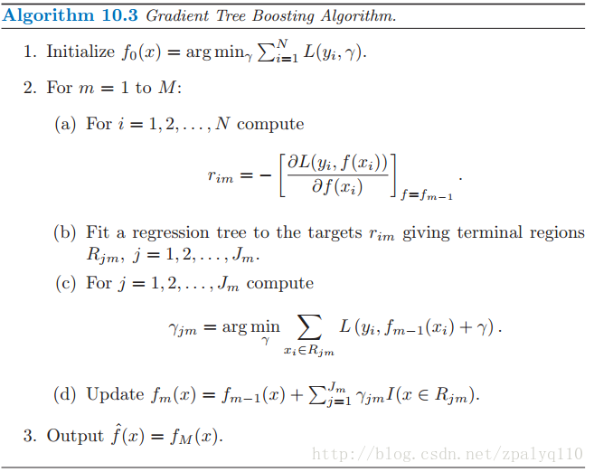

## 写在前面

* [Boosting](https://blog.csdn.net/xiaohukun/article/details/78189281)
    * 任意给定仅比随机猜测略好的弱学习算法 ,是否可以将其提升为强学习算法 ? 
    如果二者等价 ,那么只需找到一个比随机猜测略好的弱学习算法就可以将其提升为强学习算法 ,而不必寻找很难获得的强学习算法。
    * Boostrapping:
        * 重复地从一个样本集合D中采n个样本
        * 针对每次采样的子样本，进行统计学习，获得假设Hi
        * 将若干个假设进行组合，形成最终的假设Hfinal
        * 将最终的假设用于具体的分类任务
    * Bagging
        * 从整体样本集合中抽样产生不同的训练集并训练弱分类器
        * 用分类器对分类进行投票，最终的分类结果是弱分类器投票的优胜结果

* [Boosting](https://zhuanlan.zhihu.com/p/26215100)
    * AdaBoost
        * AdaBoost解决了如下两个问题:首先,如何选择一组有不同优缺点的弱学习器,使得它们可以相互弥补不足。
        其次,如何组合弱学习器的输出以获得整体的更好的决策表现
        * 当我们要把每个弱学习器的判断组合到最终的预测结果中时，如果弱学习器在之前的任务中表现优异，我们会更多的相信它，
        相反，如果弱学习器在之前的任务中表现较差，我们就更少的相信它。换句话说,我们会加权地组合弱学习器，
        给每个弱学习器赋予一个表示可信程度的值a_t ，这个值取决于它在被分配的任务中的表现，表现越好a_t越大，反之越小。

* [Bagging and Boosting are both ensemble methods in Machine Learning, but what’s the key behind them?](https://quantdare.com/what-is-the-difference-between-bagging-and-boosting/)
    * 与Boosting相对的，就是Bagging方法，Boosting属于一种串行的集成方式，而Bagging是一种并行的集成方式。
    * Bagging, 任何元素以相同的概率出现在数据集中，然而， Boosting 观测值被加权，因此一些数据将更容易被加入到数据集。 \
    
    
    

* [为什么说bagging是减少variance，而boosting是减少bias?](https://www.zhihu.com/question/26760839)
    * 
    
## 基础知识
  
### Adaboost

* 优点：泛化错误率低，易编码，可以应用在大部分分类器上，无参数调整
* 缺点：对离群点敏感
* 使用数据类型：数值型和标称型数据



## GBDT（Gradient Boosting Decision Tree，梯度提升决策树。）

* [Github项目代码](https://github.com/jiye-ML/ensemble_learning_GBDT)

* [GBDT算法原理以及实例理解](https://blog.csdn.net/zpalyq110/article/details/79527653)
    * GBDT 的全称是 Gradient Boosting Decision Tree，梯度下降树
    * GBDT使用的决策树就是CART回归树，无论是处理回归问题还是二分类以及多分类，GBDT使用的决策树自始至终都是CART回归树。 
    * 以CART回归树作为基本的决策树算法  
    * 学习器是一个累加的过程，每次增加一个学习器，然后对集成的学习器求每个样本的残差，通过拟合残差变小来更新；
        * 经过负梯度拟合得到了y−f(xi)，
        
    
    
    
## 手写笔记





