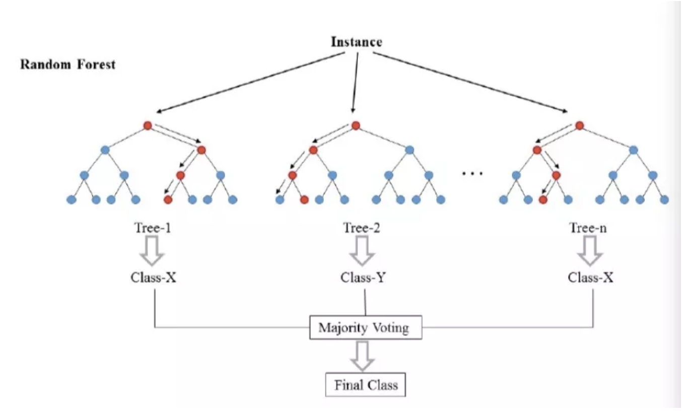

* 随机森林可能是bagging集成中最著名的算法，它以决策树作为基学习器，仍然采用自助采样法训练基学习器：

* 模型的差异化除了靠随机采样所产生的数据扰动，还会添加特征扰动。传统的决策树会对于每棵树上的节点划分，我们会在当前节点上数据所具备的全部属性中通过信息增益或者gini指数的办法来挑出一个最佳属性，作为生成下一节点的划分属性。但随机森林为了增大模型的差异性，还会随机选择一个特征子集，这个子集可以是少部分特征的集合，也可以由特征组合而来（聪明的读者马上会想到，这正是我们前面所讲解的特征选择和降维的另一用处）。这样，每一个基学习器的性能其实都比不上单棵决策树，但组合起来，却会让随机森林的表现远远优于普通的决策树。